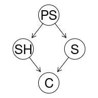
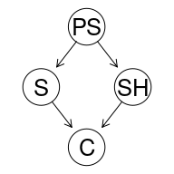

blah
================

### Set-up

The examples are given in R code, which we intertwine with additional
explanations, which the reader is welcome to skip if they look familiar.

First, you need to install the relevant R libraries. This is a bit
tricky, because some of them have to be installed through BiocManager.
One way to go is this:

``` r
install.packages("https://www.bnlearn.com/releases/bnlearn_latest.tar.gz", repos = NULL, type = "source")
install.packages("BiocManager")
if (!requireNamespace("BiocManager", quietly = TRUE))
  install.packages("BiocManager")
BiocManager::install()
BiocManager::install(c("graph", "Rgraphviz"))

install.packages("https://www.bnlearn.com/releases/bnlearn_latest.tar.gz", repos = NULL, type = "source")
```

Then load the libraries we use (you need to have them installed first):

``` r
library(bnlearn)
library(Rgraphviz)
library(knitr)
library(kableExtra)
```

While Bayes’s Theorem is of immense use when it comes to calculating
various conditional probabilities, if we’re interested in the
interaction of multiple hypotheses at various levels and multiple pieces
of evidence, calculations quickly become inconvenient, to say the least.
Moreover, if such considerations are to be presented to a fact-finder,
it is rather unlikely that they would be transparent and easily
understood. Luckily, a tool exist to make such tasks easier. Bayesian
networks (BNs) can be used for a fairly transparent and computationally
more manageable evalation and presentation of the interaction of
multiple pieces of evidence and hypotheses. We’ll start with a general
presentation of BNs, and then go over a few main methods of employing
BNs in presentation, aggregation and evaluation of evidence in legal
fact-finding.

``` r
cancer1 <- empty.graph(nodes = c("PS","SH","S","C"))
cancer1.arcs <- matrix(c("PS", "SH",
                   "PS", "S",
                   "SH", "C",
                    "S", "C"),
                 byrow = TRUE, ncol = 2,
                 dimnames = list(NULL, c("from", "to")))
arcs(cancer1) = cancer1.arcs
graphviz.plot(cancer1)
```



This can be achieved in a somewhat simpler manner like this:

``` r
cancer2DAG <- model2network("[SH|PS][PS][S|PS][C|SH:S]")
graphviz.plot(cancer2DAG)
```


